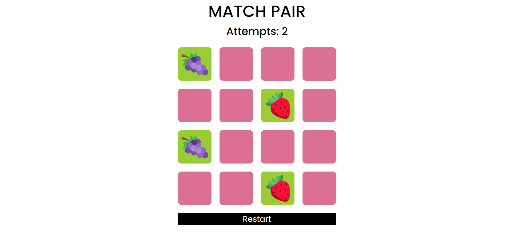

# Match Pair Game
[Hosted Link]()

The Match Pair Game is a simple and interactive memory game where players need to find matching pairs of fruit cards. The game shuffles cards, tracks the number of attempts, and provides a winning message upon completion. This project is built using HTML, CSS, and JavaScript.

### Features
- Interactive Gameplay: Click on cards to reveal them and match pairs.
- Shuffle and Restart: Cards can be shuffled and restarted with a zoom-in and zoom-out animation for a dynamic experience.
- Attempts Tracking: The game counts the number of attempts to help track performance.
- Win Condition: Alerts the player when all pairs are matched successfully.
- Responsive Design: Works well on various screen sizes.

### Usage
- Start the Game: Once the page loads, you can begin clicking on cards to reveal them.
- Match Pairs: Click two cards to see if they match. If they do, they will remain visible; otherwise, they will flip back.
- Track Attempts: The number of attempts is displayed on the screen to help you track how many guesses you've made.
- Restart the Game: Click the "Restart" button to shuffle the cards and start over, with a zoom animation enhancing the experience.

## Hosted Link

You can play the Match Pair Game online by visiting the [hosted link]().
